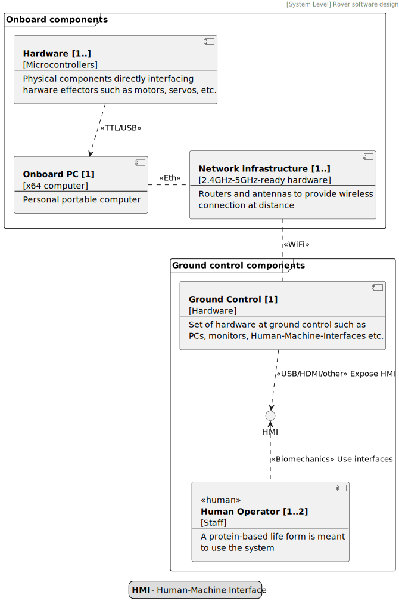
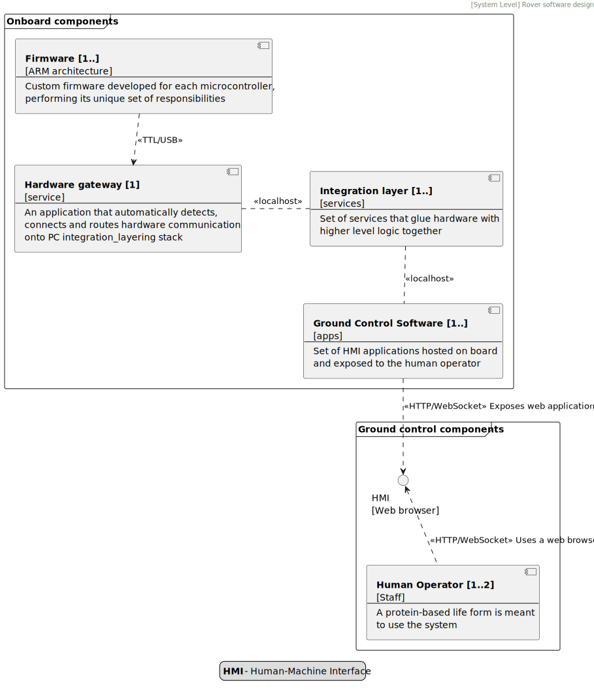

# ORION_V_2025

This document is an introduction to the project. It outlines software architecture,
it's composable nature and protocols in use.

## [C4] System level

From the high level perspective, the system comprises several elements such as hardware,
onboard PC, infrastructure, as well as complementary software. Both hardware and software
work in unison to deliver the full robotic experience, reliably.

<table>
    <tr>
        <th> Hardware design </th>
        <th> Software design </th>
    </tr>
    <tr>
        <td>

        </td>
        <td>

        </td>
    </tr>
</table>

## [C4] Container level

This is a zoomed in view into the system level software design.

