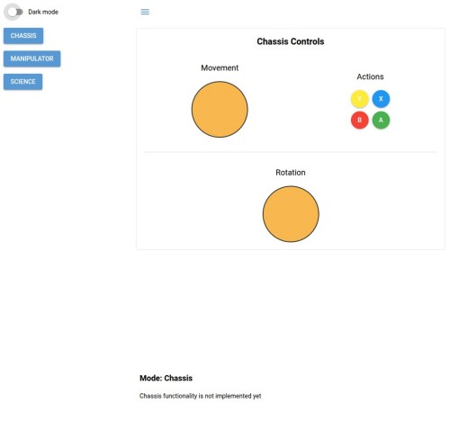
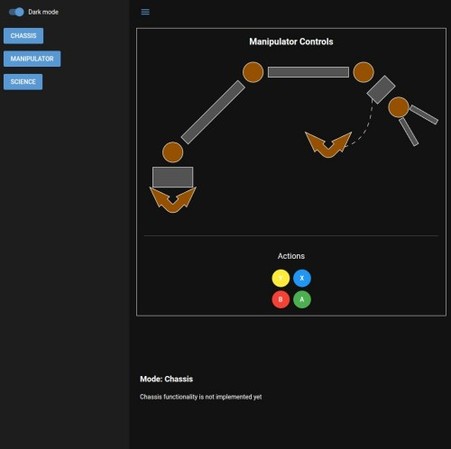

# Ground Control Web App

This is a web application designed to control a rover, featuring a modular UI, real-time telemetry, and support for various input methods.

The app is meant to be hosted on the onboard computer and accessible in any device in its local network. As the network is
strickly controlled, the application does not bother with racy conditions and multiple users at the same time
are allowed.

All service requirements have been listed here: [REQUIREMENTS.md](./REQUIREMENTS.md]

The app looks like this:


| Main UI | Manipulator UI |
|:---:|:---:|
|  |  |

## Features

*   **Modular UI:** Vertical split layout with a collapsible menu, playground, and telemetry panes.
*   **Chassis Controller:** Interactive draggable knob for movement control, with rotation and action buttons.
*   **MQTT Integration:** Real-time communication for sending commands and receiving telemetry data.
*   **Gamepad API Support:** Prioritized input from USB gamepads (Xbox Wireless Controller) and joysticks (Logitech Extreme 3D Pro).
*   **Responsive Design:** Supports PC screens and mobile devices (landscape orientation enforced).
*   **Dockerized Deployment:** Application can be built and run as a Docker image.


## Tech Stack

*   [Python3](https://www.python.org/) - main programming language
*   [UV python package manager](https://docs.astral.sh/uv/): modern package manager that turns
package management hell into pleasure
*   [NiceGUI](https://github.com/nicegui/nicegui): Modern and easy to use Web Framework for Python
    * With some TypeScript patches to handle extra things such as Gamepad API
*   [Gamepad API](https://developer.mozilla.org/en-US/docs/Web/API/Gamepad_API): For USB controller input
*   [Python MQTT Paho library](https://pypi.org/project/paho-mqtt/): MQTT5 library with WebSocket support
*   [Docker](https://www.docker.com/): Containerization platform

## Setup

To get the project up and running locally, follow these steps:

1.  **Clone the repository:**
    ```bash
    git clone <repository-url>
    cd ground-control-web-app
    ```

2.  **Install dependencies:**
    ```bash
    curl -LsSf https://astral.sh/uv/install.sh | sh
    ```


## Running the Application

To run the application simply type:

```bash
uv run main.py
```

Also check docker instructions as it's a preferable way to start the application.

### Environment Variables

The application uses the following environment variables for configuration:

*   `LOG_LEVEL`: Sets the logging verbosity (e.g., `INFO`, `DEBUG`, `WARNING`, `ERROR`). Default is `INFO`.
    Example: `LOG_LEVEL=DEBUG uv run main.py`

*   `MQTT_BROKER_URL`: The URL of the MQTT broker. For WebSocket connections, use `ws://` or `wss://` scheme. Default is `ws://mqtt5:9001`.
    Example: `MQTT_BROKER_URL=ws://localhost:9001 uv run main.py`

*   `MQTT_BROKER_PORT`: The port of the MQTT broker. Default is `1883`.
    Example: `MQTT_BROKER_PORT=1883 uv run main.py`

*   `MQTT_USERNAME`: Username for MQTT broker authentication. Default is `user`.

*   `MQTT_PASSWORD`: Password for MQTT broker authentication. Default is `user`.

### Development Mode

To run the application in development mode:

```bash
uv run main.py
```

The application will be accessible at `http://localhost:8080`.

If you don't see your changes, it might be useful to clear all environment cache:

```
uv clean
for cache in $(find ./app -name '__pycache__' -type d); do rm -rf $cache; done; echo 'Cleared cache'
```

### Docker

To build and run the application using Docker:

1.  **Build the Docker image:**
    ```bash
    docker build -t ground-control-web-app .
    ```

2.  **Run the Docker container:**
    ```bash
    docker run -d --name ground-control-app --net host ground-control-web-app
    ```

    The application will be accessible via your host machine's network, typically at `http://localhost:8080`.

## Usage

*   **Menu:** Use the buttons on the left-hand side (Chassis, Manipulator, Science) to switch between different control modes.
*   **Chassis Controller:** When in Chassis mode, use the draggable knob to control movement. The rotation buttons and Xbox-style buttons (X, Y, A, B) provide additional controls.
*   **Telemetry Pane:** The bottom right pane displays real-time telemetry data when in Chassis mode.