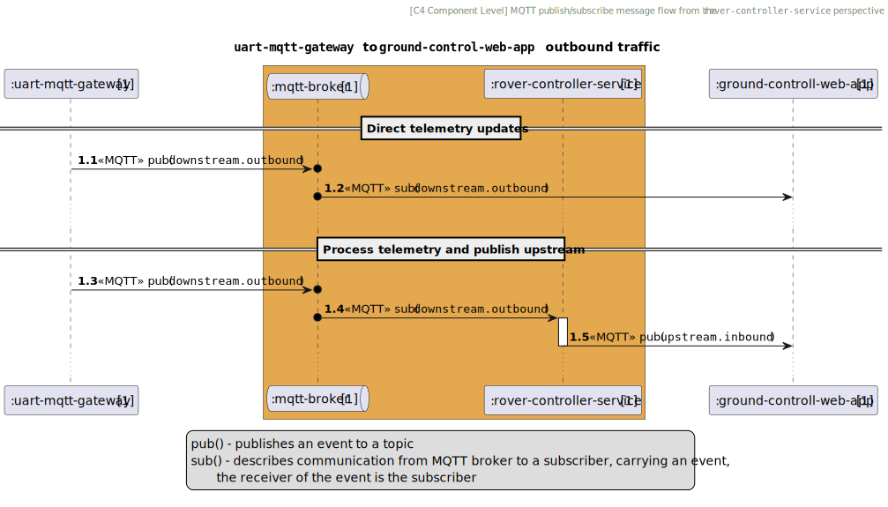
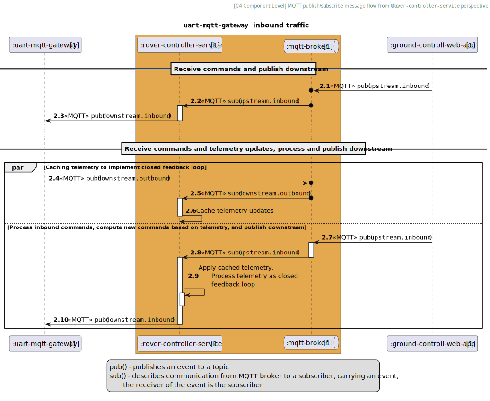

# Requirements overview

This document specifies a list of requirements for the `rover-controller-service` project.
The application is designed to link near real-time event processing with the remote control of a robotic platform.

The platform comprises modules such as chassis, manipulator, science and power.
The `rover-controller-service` aggregates each hardware module and implements corresponding
behavior as described in [Functional requirements section](#functional-requirements).

# Tech stack

* [Java 21](https://docs.oracle.com/en/java/javase/21/): A programming language of choice
* [Spring Boot](https://spring.io/projects/spring-boot): A comprehensive application framework
* [Spring Actuator](https://docs.spring.io/spring-boot/docs): Ensures the service remains alive and provides monitoring capabilities.
* [Hive MQTT Library](https://github.com/hivemq/hivemq-mqtt-client-java): MQTT asynchronous library for Java
* [SL4J](https://www.slf4j.org/): A logging wrapper for Java
* [Mockito](https://site.mockito.org/): Mocking framework for unit testing in Java
* [Testcontainers](https://testcontainers.org/): Integration tests for MQTT

# Non-functional Requirements
The key words "MUST", "MUST NOT", "REQUIRED", "SHALL", "SHALL NOT", "SHOULD", 
"SHOULD NOT", "RECOMMENDED", "MAY", and "OPTIONAL" in this document are to be 
interpreted as described in [RFC 2119](https://tools.ietf.org/html/rfc2119).

## General

* MQTT client shall be configured as globally accessible bean for any service within the project
* MQTT shall be configured by following this YAML pattern:
```
mqtt:
    client-id: rover-controller-service
    broker:
        url: localhost
        port: 1883
        username: ${MQTT_USERNAME}
        password: ${MQTT_PASSWORD}
    connection:
        timeout.ms: 5000
        keepalive.ms: 60000
        reconnect.delay.ms: 5000
```
* MQTT username and password shall be passed as environment variables
* The application must expose an endpoint to monitor the liveness and readiness of the application
* Application readiness must be defined as: all beans have been created and the MQTT connection
is established
* Application liveness must be defined as: the application maintains connectivity with the MQTT broker
* The application shall use `mqtt://` protocol by default
* The application shall use MQTT QoS 1 setting (at least once delivery)
* The garbage collector shall be tuned for the lowest possible latency

## Testing

* Every public method in controllers, services shall be tested
* Every method other than public methods should be tested, on a case-by-case basis.
* Integration testing shall verify both inbound and outbound traffic flows
* Integration testing shall rely on testcontainers to deploy a mock MQTT server
* Integration testing shall rely on a custom Java bean to create an `MqttClient` for testing purposes

# Functional requirements

## `application.yml` configuration template
[`application.yml` configuration template](#applicationyml-configuration-template)

Configuration fields for the `rover-controller-service` must be defined as follows:
* Whenever the `downstream.inbound` topic is mentioned, the application shall publish to it.
* Whenever the `downstream.outbound` topic is mentioned, the application shall subscribe to it.
* Whenever the `upstream.inbound` topic is mentioned, the application shall subscribe to it.
* Whenever the `upstream.outbound` topic is mentioned, the application shall publish to it.

Template (follow *integration requirements* sections below for more details on `application.yml` configuration per specific *business-category*):
```
<<business-category>>:
    eventType: <<category-name>>
    downstream:
        inbound: template/topic/name/inbound
        outbound: template/topic/name/outbound
    upstream:
        inbound: template/topic/name/controller/inbound
        outbound: template/topic/name/controller/outbound
```

<table>
    <tr>
        <th> System outbound traffic </th>
        <th> System inbound traffic </th>
    </tr>
    <tr>
        <td>


        </td>
        <td>


        </td>
    </tr>
</table>

## Chassis integration requirements

* All functional chasiss integration requirements shall be defined in the [Chassis Integration Requirements](./REQUIREMENTS_CHASSIS.md) file
* All above-mentioned functional and non-functional requirements shall be applied


## Manipulator integration requirements

* All functional manipulator integration requirements shall be defined in the [Manipulator Integration Requirements](./REQUIREMENTS_MANIPULATOR.md) file
* All above-mentioned functional and non-functional requirements shall be applied


## Science integration requirements

* All functional manipulator integration requirements shall be defined in the [Science Integration Requirements](./REQUIREMENTS_SCIENCE.md) file
* All above-mentioned functional and non-functional requirements shall be applied