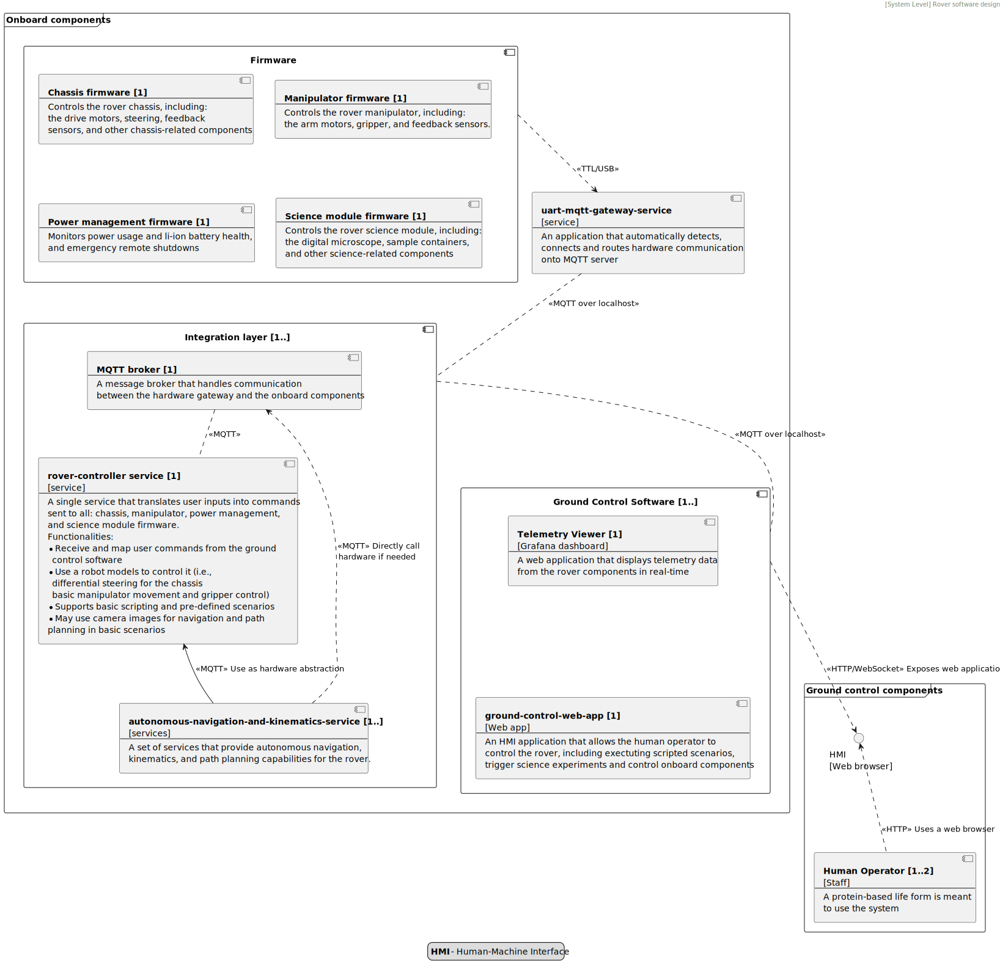
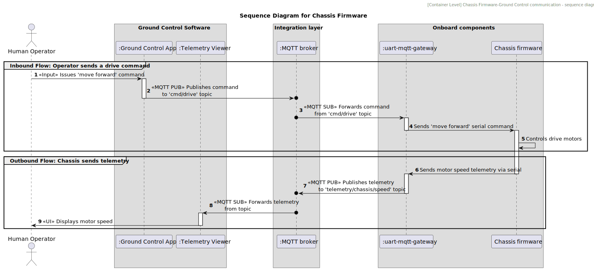

# uart-mqtt-gateway

`uart-mqtt-gateway` service translates UART full-duplex communication into
MQTT-driven events. In this way, any onboard device can be connected to the TCP/IP stack
and therefore it can be controlled remotely.



The service is meant to be part of a bigger project that designs and builds a Mars rover
to compete in the European Rover Challenge. The robot comprises several microcontrollers that
control the chassis and driving model, manipulator and inverse kinematics, science experiments,
and monitor power usage and Li-ion battery management.

Each microcontroller is connected to a PC (x64) with a UART-USB converter. The `uart-mqtt-gateway`
service routes communication inbound and outbound. The application accepts
incoming UART traffic and converts the messages into MQTT messages. Similarly, the service
delivers MQTT messages to corresponding UART devices. In this way, the application provides:
* full-duplex communication
* a universal interface to implement higher-level logic (i.e., inverse kinematics, traversal planning,
mission scripting, etc.)

The service is the key to integrating individual components into a single robotic platform.


## Functionalities

* **Hot-swappable UART connectivity**: Connect/disconnect your device on the fly.
* **Automatic message routing**: Route messages to corresponding MQTT topics, configurable mapping
* **Accept inbound messages**: Read inbound MQTT messages and redirect to corresponding UART devices


## Architecture

The service leverages Java multithreading capabilities:
* Any newly detected device spins up a new thread
* Any recently disconnected device is safely removed from resources and MQTT messages will not be processed
* The service periodically checks for new devices (in 1s intervals by default, configurable)
* The service relies on a universally acknowledged JSON schema to map a device to corresponding MQTT topics, as presented below. Messages are delimited with `\n\n` by default
* The service publishes any errors to the MQTT error topic to notify a human operator
* The service does not interfere with the payload. It reads only one predefined 
field (`eventType`, by default) to match configuration and corresponding MQTT topics
* The configuration is specified in a separate file: `uart-mqtt-mapping.yml`
* The application is launched on port 8088 by default (see yaml configuration)

A typical flow (here Chassis control is an example) can be summarized with the following sequence diagram:



### JSON schema
```
{
 "eventType": "(power|manipulator|chassis|science)",
 "payload": {
   "value1": "",
   [...]
 }
}
```

Legend (mandatory fields):
* `eventType` - a device unique identifier. A single label shall be associated with only one UART device

### `uart-mqtt-mapping.yml`
```
uuart-mqtt-gateway:
  error-topic: orion/topic/error

  mqtt:
      broker-url: localhost
      broker-port: 1883
      client-id: uart-mqtt-gateway
      connection-timeout-s: 5
      keep-alive-interval-s: 60
      reconnect-delay-ms: 5000

  serial:
      scan-interval-ms: 1000
      delimiter: "\n\n"
      allowed-port-name-prefixes: 
        - /dev/ttyUSB
        - /dev/ttyACM
      baud-rate: 115200
      data-bits: 8
      stop-bits: 1
      parity-bit: 0
      read-timeout-ms: 100
      write-timeout-ms: 100

  uart-mqtt-mapping:
      - label: chassis-microcontroller
        eventType: chassis
        mqtt:
          inbound: orion/topic/chassis/inbound
          outbound: orion/topic/chassis/outbound
      - label: manipulator-microcontroller
        eventType: manipulator
        mqtt:
          inbound: orion/topic/manipulator/inbound
          outbound: orion/topic/manipulator/outbound
      - label: power-microcontroller
        eventType: power
        mqtt:
          inbound: orion/topic/power/inbound
          outbound: orion/topic/power/outbound
      - label: science-microcontroller
        eventType: science
        mqtt:
          inbound: orion/topic/science/inbound
          outbound: orion/topic/science/outbound

```


## Tech stack

* Java 21
* jSerialComm
* MQTT (hivemq-mqtt-client)
* Spring Boot
* Gradle (gradle-wrapper)
* Docker

## Launch

Assign the correct user group to access serial port:
```
sudo usermod -a -G dialout $USER
```

Launch MQTT server locally:
```
docker run -it --net host eclipse-mosquitto
```

Assuming the default configuration is sufficient, simply run:
```
export MQTT_USERNAME=user
export MQTT_PASSWORD=user

./gradlew bootRun
```

Alternatively, you can launch the application with Docker:
```/usr/bin/env bash
docker build -t uart-mqtt-gateway .
```

To run the Docker container with access to serial ports:
```/usr/bin/env bash
docker run --rm --privileged -v /dev:/dev -eMQTT_USERNAME=user -eMQTT_PASSWORD=user --name uart-mqtt-gateway uart-mqtt-gateway
```